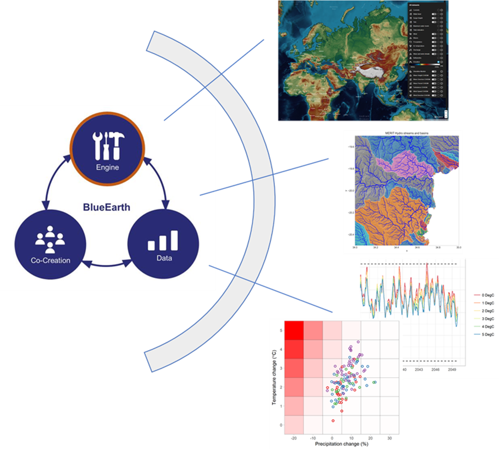

# BlueEarth Climate Stress Test toolbox

[](https://github.com/tanerumit/blueearth_cst/actions/workflows/ci.yml)

> [!NOTE]
> **Fork status.** This is a personal fork of
> [Deltares/blueearth_cst](https://github.com/Deltares/blueearth_cst). Three
> planned phases are complete:
>
> - **Phase 1 — Foundation** (sealed, `v0.2.0-alpha`): replication baseline,
>   pixi-based env, library upgrades (hydromt 1.x, Wflow.jl 1.0.x), unit-test
>   coverage.
> - **Phase 2 — Refactor** (sealed 2026-07-23, R1–R6): modularity contracts,
>   naming conventions, one milestone per workflow, then the structural refactor
>   that moved `src/` to the `blueearth_cst` package and split `config/` into
>   `workflows` / `catalogs` / `templates`.
> - **Phase 3 — Usability & flexibility** (sealed 2026-07-25, P3-1…P3-3):
>   project/experiment structure, model-independent climate analysis, model-swap
>   interchange contracts, and performance work (the wf3 stress-test sweep is
>   ~35 % faster, value-identical).
>
> Phase 4 is open; CI was its first item. `dev/roadmap.md` is the authoritative
> status record — this note summarises it and may lag. See also `CHANGELOG.md`,
> which tracks releases rather than milestones.

The BlueEarth Climate Stress Test toolbox (`blueearth_cst`) is a free,
open-source toolkit for interactive climate risk assessment based on bottom-up
analysis principles. It enables end-users to:

- Explore the range of hydro-climatic uncertainty in a chosen geographic area,
  including natural variability and climate-change signals.
- Design and execute climate stress tests against user-defined thresholds and
  metrics.
- Assess the plausibility of identified vulnerabilities using climate model
  projections — i.e. estimate how sensitive a chosen metric is to climate
  change.
- Visualize results for non-specialist audiences.

The toolbox is part of the [BlueEarth](https://blueearth.deltares.org/)
initiative and uses [weathergenr](https://github.com/tanerumit/weathergenr) as
its weather generator and [Wflow](https://github.com/Deltares/Wflow.jl) for
hydrological modelling.



## Installation

`blueearth_cst` is a Python + R + Julia toolbox. Python and R dependencies are
managed with [pixi](https://pixi.sh/); Julia and Wflow.jl are managed via the
standard `Project.toml` / `Manifest.toml`. A single `pixi run install` task
wires both layers together.

For a step-by-step walkthrough of a fresh install, see `docs/install.md`.

### Prerequisites

1.  **pixi** (manages Python 3.12 + R 4.4 via conda-forge; the exact pins live
    in `pixi.toml` — R is held at 4.4 because conda-forge's 4.5 `r-waveslim`
    build is broken on win-64).

    Windows (PowerShell):

    ```powershell
    iwr -useb https://pixi.sh/install.ps1 | iex
    ```

    Or via winget: `winget install prefix-dev.pixi`. Restart your shell after
    install.

2.  **Julia 1.11.7** via [juliaup](https://github.com/JuliaLang/juliaup).
    conda-forge has no win-64 Julia build, and Wflow.jl 1.0.x deadlocks under
    Julia 1.12. The exact patch is pinned: every Julia call the toolbox makes
    carries the `+1.11.7` selector, so any other 1.11.x fails to start. After
    installing juliaup:

    ```console
    juliaup add 1.11.7
    ```

    Verify with `julia +1.11.7 --version` (expect `1.11.7`). No
    `juliaup default` is needed — the selector picks the version.

3.  Clone the repo:

    ```console
    git clone https://github.com/tanerumit/blueearth_cst.git
    cd blueearth_cst
    ```

### Install

```console
pixi install         # Python + R toolchain (conda-forge)
pixi run install     # weathergenr (R) + Wflow.jl (Julia)
```

The first command installs everything declared in `pixi.toml` into a local
`.pixi/` env. The second runs `dev/scripts/install_weathergenr.R` (installs
`tanerumit/weathergenr@v1.2.0`) and
`julia +1.11.7 --project=. -e 'using Pkg; Pkg.instantiate()'` (locks Wflow.jl
and ~130 transitive Julia deps from `Manifest.toml`).

To activate the env in your shell:

```console
pixi shell
```

### Docker

> [!WARNING]
> **Not supported in v0.2.0-alpha.** Docker / Linux end-to-end validation is
> **deferred** in this fork — see "Deferred: Linux replication" in
> `dev/roadmap.md`. The `Dockerfile` builds against the pixi env but is not
> exercised in CI. Docker support will be re-introduced in a later Phase 2
> milestone.
>
> The instructions below describe the **v0.1.0-alpha** (upstream conda-based)
> Docker workflow and remain valid for users of that release. They do **not**
> apply to v0.2.0-alpha or later pixi-based releases.

A pre-built image of the v0.1.0-alpha conda-based stack remains available at
`containers.deltares.nl/CST/cst_workflows:0.1.0`:

```console
docker pull containers.deltares.nl/CST/cst_workflows:0.1.0
```

## Running

The toolbox provides three [Snakemake](https://snakemake.github.io/) workflows:

- **Snakefile_model_creation** — builds a Wflow model from global data for the
  selected region and runs / analyses it for a historical period.
- **Snakefile_climate_projections** — derives future climate statistics
  (temperature and precipitation change) for a chosen set of CMIP scenarios and
  GCMs.
- **Snakefile_climate_experiment** — generates future weather realizations,
  applies stress-test perturbations, and runs the hydrological model on each
  realization × stress combination.

Configuration is YAML-driven. An example is at
`config/workflows/snake_config_model_test.yml`. Configs live under
`config/workflows/`, hydromt data catalogs under `config/catalogs/`, and
hydromt/wflow/weathergen build templates under `config/templates/`.

Each run writes its generated model and result artifacts to the `project_dir`
set in the config. For production use, point `project_dir` at a location
**outside the repository tree** so outputs are kept separate from the toolbox
source. (The in-repo `test_case/test_local` directory is a dev/test convention
only.)

### Configuration and run provenance

Each workflow keeps its established current config copy for project-consistency
checks and also writes a content-addressed snapshot bundle. The bundle contains
the original YAML, Snakemake's merged effective config, the resolved
toolbox-wide advanced settings, and hashed copies of referenced catalogs,
templates, and observation files. Project-level bundles live under
`<project_dir>/config/runs/<workflow>/<snapshot-digest>/`; climate-experiment
bundles live under the same path inside the experiment directory. Changing a
setting or referenced file produces a new bundle instead of overwriting its
history.

The directory is named by the first 12 characters of the bundle's SHA-256, the
same short form used for the archived files inside it. The full digest is kept
in the bundle's `referenced-files.json` as `snapshot_bundle_sha256`, and the
short name is a prefix of it. The name has to be derived from content: the
bundle directory is a Snakemake output whose path is computed while the DAG is
built, so a timestamp or a run counter would make every parse see a missing
output and re-snapshot forever. Rule `snapshot_config` logs the bundle path and
its full digest, so a run tells you where its configuration was recorded.

Runs launched through `scripts/run_workflows.py` additionally write one
immutable invocation manifest under `<project_dir>/config/runs/invocations/`. It
records enabled workflows, sanitized arguments, start/end status, config and
lock-file digests, and Git/runtime identity. Direct `snakemake` invocations
still receive the configuration snapshot, but only the wrapper can record the
complete invocation lifecycle, including failures and no-op runs.

Each workflow records itself in **one log and one benchmark table**, both
regenerated on every run:

- **Snakefile_model_creation** — `logs/wf1_model_creation.log`
- **Snakefile_climate_projections** — `logs/wf2_climate_projections.log`
- **Snakefile_climate_experiment** —
  `experiments/<name>/logs/wf3_climate_experiment.log`

Rules log to `logs/_parts/` while they run; a final `gather_logs` rule merges
the parts into the single log — one `== W.NN  rule_name` section per rule — then
deletes them. Benchmarks work the same way, into
`benchmarks/wf<N>_benchmarks.md`. See `docs/migration-r08-wf2.md` ("One log per
workflow") for the format and for cleaning up per-rule logs left by earlier
runs.

### Running from pixi shell

Activate the env, then invoke `snakemake` against the Snakefile and config of
your choice:

```console
$ pixi shell
$ cd blueearth_cst
$ snakemake all -c 1 -s Snakefile_model_creation \
    --configfile config/workflows/snake_config_model_test.yml
```

See the per-workflow sections below for the recommended sequences (DAG
visualization, unlocking, full run).

Common `snakemake` flags:

- `-s`: which Snakefile to run.
- `--configfile`: path to the YAML config.
- `-c`: number of cores (more than 1 enables parallelism).
- `--dry-run` (`-n`): list rule executions without running them.
- `--unlock`: clear the working-directory lock left by a crash.
- `--keep-going` (`-k`): keep running independent jobs after a failure.

For all options see the [Snakemake CLI
documentation](https://snakemake.readthedocs.io/en/stable/executing/cli.html).
More example invocations are in `scripts/run_snake_test.cmd`.

### Running all enabled workflows with the wrapper

Instead of invoking each Snakefile by hand, `scripts/run_workflows.py` reads the
`workflows.<name>.enabled` flags in a full-orchestration config and runs
`snakemake` for exactly the enabled workflows, in order (model → projections →
experiment):

```console
$ pixi run python scripts/run_workflows.py \
    --config config/workflows/snake_config_model_test.yml
```

Contract:

- Accepts **full-orchestration configs only** — a config carrying a `workflows:`
  section with all three subsections, each with an `enabled:` key (the
  `snake_config_model_test*.yml` / `snake_config.template.yml` class). The
  single-workflow `snake_config_projections_*.yml` configs carry no `workflows:`
  section and are run directly with `snakemake -s` instead.
- A missing `workflows:` section or `<name>.enabled` key is a **hard error**
  naming the absent key, not a silent default.
- `enabled:` must parse to a real boolean: unquoted `true` / `false` / `yes` /
  `no` / `on` / `off` are accepted; quoted `"true"` or integers `1` / `0` are
  rejected.
- The wrapper **stops on the first nonzero Snakemake exit and returns that
  code** — a failed upstream workflow is not followed by a downstream run.
- `--cores N` and any arguments after a `--` sentinel forward to every
  invocation; each workflow keeps its own flags (`--keep-going` on projections
  only).
- Every valid wrapper invocation, including a dry-run, no-op, or failed child,
  receives a unique atomically finalized manifest under
  `<project_dir>/config/runs/invocations/`. Passthrough `--config` overrides are
  sanitized and recorded there; the workflow snapshot remains authoritative for
  the merged Snakemake config.

**Skip semantics.** `enabled: false` means the wrapper does not invoke that
Snakefile, so its outputs are not produced. It does **not** delete that
workflow's prior outputs and does **not** guarantee downstream freshness: an
enabled downstream workflow consumes whatever prerequisite artifacts already
exist on disk (or fails with `MissingInputException` if they are absent) —
identical to invoking a single Snakefile directly. You are responsible for the
staleness of what a downstream workflow consumes when you disable its
prerequisite.

### Re-running an experiment after a model rebuild

An experiment records the Wflow model it was run against, and
`check_model_reference` refuses to re-run it if that model has since changed —
otherwise new model state would be mixed into old results. **Expect this refusal
after any WF1 rebuild, including one that changed nothing numeric.**
`forcing/inmaps_historical.nc` is not byte-reproducible: hydromt's write varies
the HDF5 chunk/encoding layout between runs while the values stay identical, so
a rebuild trips the guard on layout alone.

The guard is correct and must not be loosened. `write_model_reference` declares
its model inputs `ancient()` deliberately — a reference that refreshed whenever
the model changed would always match, and the comparison would be decorative.

**Re-recording the reference is an operator decision, not a chore.** It means
*"this experiment now accepts the rebuilt model."* Before you do it, read what
the error names:

- If `forcing/inmaps_historical.nc` is the **only** changed input, this is the
  known layout-only case. Delete the experiment's `config/model_reference.yml`
  and let `write_model_reference` regenerate it on the next run.
- If **anything else** is named — `staticmaps.nc`, `wflow_sbm.toml`, or the
  forcing alongside them — the guard has found something real. Do not re-record.
  Create a new experiment: the recorded one is not re-runnable against different
  physics or state.

The cost of accepting this is recorded rather than hidden: a re-record that
becomes routine is how a genuine drift eventually gets waved through. That is
the failure mode to watch for, not the noise itself. Tracked as a watch-item on
the dev board (`[R10-12]`), which re-opens if a re-record ever masks a real
drift or if hydromt gains a documented way to pin forcing encoding.

### Running from docker image

> [!WARNING]
> **v0.1.0-alpha only.** `scripts/run_snake_docker.sh` targets the upstream
> conda-based image. Not supported on the v0.2.0-alpha pixi-based fork; deferred
> per "Deferred: Linux replication" in `dev/roadmap.md`.

A script is available to run via Docker: `scripts/run_snake_docker.sh`.

### Snakefile_model_creation

Builds a hydrological Wflow model and runs / analyses it for a historical
period.

```console
$ python scripts/plot_workflow_dag.py -s Snakefile_model_creation --configfile config/workflows/snake_config_model_test.yml
$ snakemake --unlock -s Snakefile_model_creation --configfile config/workflows/snake_config_model_test.yml
$ snakemake all -c 1 -s Snakefile_model_creation --configfile config/workflows/snake_config_model_test.yml
```

The first command renders a DAG visualization (requires Graphviz's `dot`). It
writes at the scope of the run that would produce it, under that scope's `logs/`
-- `<project_dir>/logs/dag/` for workflows 1 and 2, and
`<project_dir>/experiments/<id>/logs/dag/` for workflow 3 -- creating the
directory itself. It renders the graph and runs nothing. The second command
clears any leftover working-directory lock from a prior crash. The third runs
the workflow.

### Snakefile_climate_projections

Derives future climate statistics (expected temperature and precipitation
change) for selected CMIP scenarios and GCMs.

```console
$ python scripts/plot_workflow_dag.py -s Snakefile_climate_projections --configfile config/workflows/snake_config_model_test.yml
$ snakemake --unlock -s Snakefile_climate_projections --configfile config/workflows/snake_config_model_test.yml
$ snakemake all -c 1 -s Snakefile_climate_projections --configfile config/workflows/snake_config_model_test.yml --keep-going
```

### Snakefile_climate_experiment

Prepares future weather realizations and stress-test perturbations, runs them
through the hydrological model, and aggregates the discharge statistics.

Every artifact this workflow writes hangs off
`<project_dir>/experiments/<experiment_name>/`. That config key is **optional**.
Left unset, it defaults to the project's own name plus the date the experiment
was first created — a `project_dir` of `/data/gabon_0108` gives
`experiments/gabon_0108_20260805/`.

The default **reuses** an existing dated experiment before creating a new one,
so a run tomorrow lands in the same directory as a run today and incremental
reruns keep working. (An unconditional current-date name would send each day's
run at an empty directory: every job re-runs, yesterday's outputs are orphaned,
and `--dry-run` reports a full rebuild with no stated reason.) Resolution never
creates the directory — it happens at parse time, which also runs under
`--dry-run` and `--unlock`.

To pin a deliberate name — a scenario label, or a second experiment beside the
first — run this once, before the first climate-experiment run:

```console
$ pixi run python scripts/suggest_experiment_name.py <your config>
$ pixi run python scripts/suggest_experiment_name.py <your config> --name dry_scenario
```

It reserves the directory atomically (versioning a *generated* collision to
`_v2`; a name you chose is never silently renamed) and writes
`workflows.climate_experiment.experiment_name` back into the config, leaving its
comments and layout intact. `--dry-run` prints the suggestion without writing.
An **existing value is never overwritten**: the experiment directory is what a
completed run's outputs are addressed by, so silently renaming it would strand
them. Clear the key by hand to go back to the default.

```console
$ python scripts/plot_workflow_dag.py -s Snakefile_climate_experiment --configfile config/workflows/snake_config_model_test.yml
$ snakemake --unlock -s Snakefile_climate_experiment --configfile config/workflows/snake_config_model_test.yml
$ snakemake all -c 1 -s Snakefile_climate_experiment --configfile config/workflows/snake_config_model_test.yml
```

## Testing

The test suite has three explicit tiers. For normal development, run the fast
tier; it keeps all pure/unit coverage and excludes only tests that invoke real
Snakemake workflows or require fresh Python processes:

```console
$ pixi run test-fast
```

Run the workflow/process contracts after changing a Snakefile, a workflow
boundary, or process-isolated behaviour:

```console
$ pixi run test-contract
```

The authoritative full non-integration suite remains the unfiltered run. The
Pixi task is only a memorable alias; bare `pytest tests/` has the same meaning:

```console
$ pixi run test-full
$ pixi run pytest tests/
```

`workflow_contract` marks real Snakemake CLI/API/DAG and lifecycle checks;
`process_isolation` marks non-Snakemake proofs that need fresh interpreters. The
markers partition execution cost, not coverage: the full tier runs both. In the
August 2026 clean-Windows measurement, the fast tier ran in about one minute and
the contract tier in about five minutes (roughly 1,070 tests total).

Notes on what the suite does and does not cover:

- Tests that need the untracked `test_case/test_local` fixture tree **skip**
  when it is absent, as do three end-to-end workflow tests that are opt-in
  behind `--run-integration`. Run `pytest -rs` to see every skip reason. The
  August 2026 clean-checkout profile had 31 skips: 28 fixture-dependent checks
  and the three opt-in integrations.
- `dev/scripts/check_baseline.py check` and `dev/scripts/semantic_tree_diff.py`
  compare a produced output tree against a recorded baseline. They are
  **local-only gates** — they need that fixture tree, so CI cannot run them. **A
  green CI badge does not mean the baseline was checked.**
- CI (`.github/workflows/ci.yml`) runs the unit suite on `ubuntu-latest` and
  `windows-latest` for every push to `main` and every pull request.

## Documentation

User-facing:

- **Notebooks** — Jupyter notebooks explaining each workflow live under
  `docs/notebooks/` (inherited from the [upstream
  repository](https://github.com/Deltares/blueearth_cst/tree/main/docs/notebooks)).
- **HydroMT references** — `docs/` also contains HydroMT architecture and
  user-guide content.

Fork-specific (development):

- `dev/roadmap.md` — milestone roadmap: what each phase set out to do and how it
  landed.
- `dev/reference/git-conventions.md` — branch / tag inventory plus the
  branching, tagging, and commit-message conventions.
- `docs/install.md` — step-by-step install walkthrough.
- `dev/milestones/phase-1/` — sealed foundation milestone artifacts (audits,
  plans, baseline diffs).
- `dev/milestones/r01/` … `dev/milestones/r06/` — sealed Phase 2 milestone
  designs and review records (modularity contracts, naming, the three workflows,
  structural refactor).
- `dev/milestones/p31/`, `dev/milestones/p32a/`, `dev/milestones/p32b/`,
  `dev/milestones/p33/` — sealed Phase 3 milestone designs, review records and
  evidence notes.
- `dev/tasks/` — the open backlog, with closed items retained and dated.
- `docs/migration-r06.md` — the R6 rename map (old path → new path).
- `CHANGELOG.md` — release history (release-level; milestone detail lives in
  `dev/roadmap.md`).

## Publishing

### Docker

> [!WARNING]
> **v0.1.0-alpha only.** The build / tag / push instructions below describe the
> upstream Deltares container registry workflow for the conda-based stack.
> Docker publishing is **still deferred** in the pixi-based fork — see
> "Deferred: Linux replication" in `dev/roadmap.md`. It was *not* re-introduced
> during Phase 2 or 3, and is not currently scheduled. It remains blocked on the
> same thing as Linux replication (no Linux machine), though CI's green
> `ubuntu-latest` leg now shows the linux-64 half of `pixi.lock` resolves and
> installs, which removes the largest unknown.

The entire workflow is contained in one Docker image. Build it:

```console
docker build -t cst-workflow:0.0.1 .
```

Tag and push it under a new `<<Tag>>`:

```console
docker login -u <<deltares_email>> -p <<cli_secret>> https://containers.deltares.nl
docker tag cst-workflow:0.0.1 containers.deltares.nl/CST/cst_workflows:<<Tag>>
docker push containers.deltares.nl/CST/cst_workflows:<<Tag>>
```

## License

Copyright (c) 2021, Deltares.

This program is free software: you can redistribute it and/or modify it under
the terms of the GNU General Public License as published by the Free Software
Foundation, either version 3 of the License, or (at your option) any later
version.

This program is distributed in the hope that it will be useful, but WITHOUT ANY
WARRANTY; without even the implied warranty of MERCHANTABILITY or FITNESS FOR A
PARTICULAR PURPOSE. See the GNU General Public License for more details.

You should have received a copy of the GNU General Public License along with
this program. If not, see <https://www.gnu.org/licenses/>.
