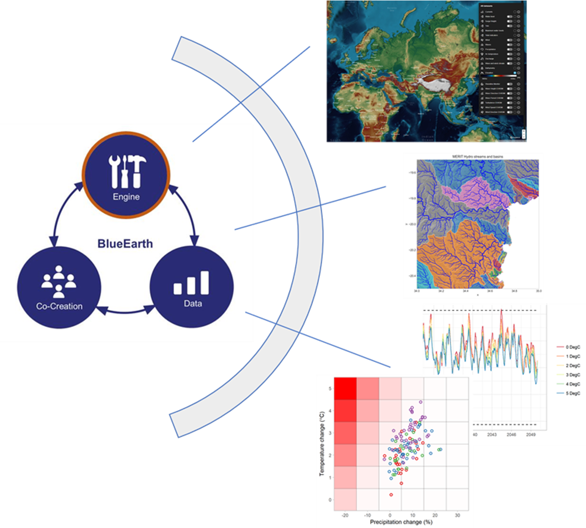

BlueEarth Climate Stress Test toolbox
#####################################

The BlueEarth Climate Stress Test toolbox (blueearth_cst) is a free, open-source, and online toolbox for interactive climate risk assessment based on bottom-up analysis principles. 
The toolbox is under development and will enable end-users to: 

 - Explore the range of hydro-climatic uncertainty in a selected geographic area of choice, including natural variability and climate change signals.  

 - Design and execute a climate stress test for the response and vulnerabilities of user-defined thresholds and metrics.  

 - Make a judgment on the plausibility of vulnerabilities identified using climate model projections. As such, users should be able to estimate up to what extent the chosen metric or parameter may be sensitive to climate change. 

 - Provide a user-friendly tool with visualization elements that satisfy the needs and expectations of non-specialized audiences 

The Climate Stress Tester is part of the BlueEarth_ initiative and uses weathergenr_ as weather generator and Wflow_ for hydrological modelling.

.. _BlueEarth: https://blueearth.deltares.org/

.. _weathergenr: https://github.com/Deltares/weathergenr

.. _Wflow: https://github.com/Deltares/Wflow.jl

Installation
============
BlueEarth CST is a python package that makes use of BlueEarth HydroMT to build the model (python), weathergenr to prepare the weather realization and stress tests (R), and Wlfow 
hydrological model (Julia). We have three types of installation available: conda, docker and developer installation.

Conda installation
------------------
This installation allows you to install a released version of the toolbox using conda/mamba package manager. The installation steps are as follow:

1. For both python and R installation we recommend using either conda and `Miniconda <https://docs.conda.io/en/latest/miniconda.html>`_ 
or conda/mamba and `Miniforge <https://github.com/conda-forge/miniforge>`_.

2. Install Julia from https://julialang.org/downloads/ and Wflow following the instructions from the 
`installation documentation <https://deltares.github.io/Wflow.jl/dev/user_guide/install/#Installing-as-Julia-package>`_.

3. Go to the `release page <https://github.com/Deltares/blueearth_cst/releases>`_ of the toolbox and download the version you wish to install 
(under Assets, folder "Source code.zip"). Unzip the downloaded folder in the folder of your choice. For Windows users, you also have an environment 
lock file with fixed dependency that you can decide to use (eg environment_0.1.0_win-64.yml for release 0.1.0)

Windows
~~~~~~~

4. Make and activate a new blueearth-cst conda environment based either on the provided lock file. This will install all python and R dependencies to run the 
tool. For this open your terminal and navigate to the folder where the lock file is located (using cd command to change directory) and run the following commands.
The last line will install the weathergenr package:

.. code-block:: console

    $ conda env create -f environment.yml
    $ conda activate blueearth-cst
    $ Rscript src/weathergen/install_rpackages.R

Linux
~~~~~

4. Make and activate a new blueearth-cst conda environment based either on the provided lock file. This will install all python and R dependencies to run the 
tool. For this open your terminal and navigate to the folder where the lock file is located (using cd command to change directory) and run the following commands.
The last line will install the weathergenr package:

.. code-block:: console

    $ conda env create -f environment_linux.yml
    $ conda activate blueearth-cst
    $ Rscript src/weathergen/install_rpackages.R

Docker
------
The workflow is also available as a docker image, with all dependencies preinstalled.

.. code-block:: console
    docker pull https://containers.deltares.nl/CST/cst_workflows:0.1.0

Developer installation
----------------------
This installation allows you to install the latest version of the toolbox using conda/mamba package manager. The installation steps are as follows:

1. For both python and R installation we recommend using conda and `Miniconda <https://docs.conda.io/en/latest/miniconda.html>`_.

2. Install Julia from https://julialang.org/downloads/ and Wflow following the instructions from the 
`installation documentation <https://deltares.github.io/Wflow.jl/dev/user_guide/install/#Installing-as-Julia-package>`_.

3. Download (clone) the BlueEarth_cst ``git`` repo from `github <https://github.com/Deltares/blueearth_cst>`_, then navigate into the 
the code folder (where the environment.yml file is located):

.. code-block:: console

    $ git clone https://github.com/Deltares/blueearth_cst.git
    $ cd blueearth_cst

Windows
~~~~~~~

4. Make and activate a new blueearth-cst conda environment based on the environment.yml file contained in the repository. This will install all python and R dependencies to run the 
tool:

.. code-block:: console

    $ conda env create -f environment.yml
    $ conda activate blueearth-cst
    $ Rscript src/weathergen/install_rpackages.R

Linux
~~~~~

4. Make and activate a new blueearth-cst conda environment based on the environment.yml file contained in the repository. This will install all python and R dependencies to run the 
tool:

.. code-block:: console

    $ conda env create -f environment_linux.yml
    $ conda activate blueearth-cst
    $ Rscript src/weathergen/install_rpackages.R

Running
=======
BlueEarth CST toolbox is based on several workflows developed using Snakemake_ . Three workflows are available:

 - **Snakefile_model_creation**: creates a Wflow model based on global data for the selected region and run and analyse the model results for a historical period.
 - **Snakefile_climate_projections**: derives future climate statistics (expected temperature and precipitation change) for different RCPs and GCMs (from CMIP dataset).
 - **Snakefile_climate_experiment**: prepares future weather realizations and climate stress tests and run the realizations with the hydrological model.

To prepare these workflows, you can select the different options for your model region and climate scenario using a config file. An example is available in the folder 
config/snake_config_model_test.yml.

You can run each workflow using the snakemake command line, after activating your blueearth_cst conda environment.

Running from conda environment
------------------------------
Before running the workflows, you need to activate your conda environment where you installed the necessary packages and navigate into the folder where the
snakefiles are located:

.. code-block:: console

    $ conda activate blueearth-cst
    $ cd blueearth_cst

Then you can run the workflows using the snakemake commands detailed below.

Running from docker image
-------------------------
A script is available to run via docker: `run_snake_docker.sh`

Snakefile_model_creation
------------------------
This workflow creates a hydrological wflow model, based on global data for the selected region, and runs and analyses the model results for a historical period.

.. code-block:: console

    $ snakemake -s Snakefile_model_creation --configfile config/snake_config_model_test.yml  --dag | dot -Tpng > dag_all.png
    $ snakemake --unlock -s Snakefile_model_creation --configfile config/snake_config_model_test.yml
    $ snakemake all -c 1 -s Snakefile_model_creation --configfile config/snake_config_model_test.yml

The first line will activate your environment, the second creates a picture file recapitulating the different steps of the workflow, the third will if needed unlock your directory 
in order to save the future results of the workflow, and the fourth line runs the workflow (here for model creation).

With snakemake command line, you can use different options:

- **-s**: selection of the snakefile (workflow) to run (see list above).
- **--config-file**: name of the config file with the model and climate options.
- **-c**: number of cores to use to run the workflows (if more than 1, the workflow will be parallelized).
- **--dry-run**: returns the list of steps (rules) in the workflow that will be run, without actually running it.

There are many other options available, you can learn more in the `Snakemake CLI documentation <https://snakemake.readthedocs.io/en/stable/executing/cli.html>`_

More examples of how to run the workflows are available in the file run_snake_test.cmd .

.. _Snakemake: https://snakemake.github.io/

Snakefile_climate_projections
-----------------------------
This workflow derives future climate statistics (expected temperature and precipitation change) for different RCPs and GCMs (from CMIP dataset).

.. code-block:: console

    $ snakemake --unlock -s Snakefile_climate_projections --configfile config/snake_config_model_test.yml
    $ snakemake -s Snakefile_climate_projections --configfile config/snake_config_model_test.yml --dag | dot -Tpng > dag_projections.png
    $ snakemake all -c 1 -s Snakefile_climate_projections --configfile config/snake_config_model_test.yml --keep-going 

Snakefile_climate_experiment
----------------------------
This workflow prepares future weather realizations and climate stress tests and run the realizations with the hydrological model.
Finally it derives the results of the stress test and the model run.

.. code-block:: console

    $ snakemake -s Snakefile_climate_experiment --configfile config/snake_config_model_test.yml  --dag | dot -Tpng > dag_climate.png
    $ snakemake --unlock -s Snakefile_climate_experiment --configfile config/snake_config_model_test.yml
    $ snakemake all -c 1 -s Snakefile_climate_experiment --configfile config/snake_config_model_test.yml

Documentation
=============

We do not yet have a detailed documentation but you can find Jupyter Notebooks explaining in details how to run each workflow and
what are the expected inputs and outputs. You can find these examples in the folder **docs/notebooks** or your downloaded version of the toolbox.
Or online for the `latest version <https://github.com/Deltares/blueearth_cst/tree/main/docs/notebooks>`_.

Publishing
==========

Docker
------

The entire workflow is contained in one docker image at the base level. Build it using:
.. code-block:: console
    docker build -t cst-workflow:0.0.1 .

Tag and push the image to a new <<Tag>> using:
.. code-block:: console
    docker login -u <<deltares_email>> -p <<cli_secret>> https://containers.deltares.nl
    docker tag cst-workflow:0.0.1 https://containers.deltares.nl/CST/cst_workflows:<<Tag>>
    docker push https://containers.deltares.nl/CST/cst_workflows:<<Tag>>

Acknowledgements
================
The development of the BlueEarth Climate Stress Testing Toolbox came from a joint 
collaboration between Deltares and the World Bank. The underlying research was 
supported by Deltares and the World Bank and we would like to thank the World Bank for
their financial support.

The toolbox is still under development and we welcome any feedback or suggestions for
improvement. We believe that it will be a valuable resource that will benefit many users.

.. _image:: docs/_images/company_logos.png

License
=======

Copyright (c) 2021, Deltares

This program is free software: you can redistribute it and/or modify
it under the terms of the GNU General Public License as published by
the Free Software Foundation, either version 3 of the License, or
(at your option) any later version.

This program is distributed in the hope that it will be useful,
but WITHOUT ANY WARRANTY; without even the implied warranty of
MERCHANTABILITY or FITNESS FOR A PARTICULAR PURPOSE.  See the
GNU General Public License for more details.

You should have received a copy of the GNU General Public License
along with this program.  If not, see <https://www.gnu.org/licenses/>.

