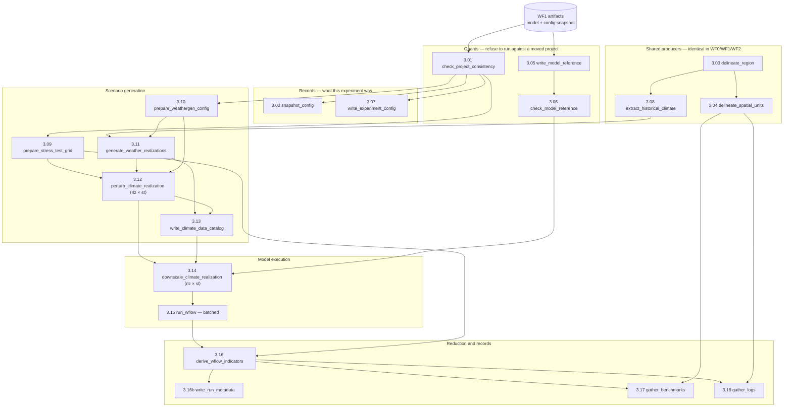

# WF3 `run_stress_test.smk` — every rule, its scripts, and its file shapes

Status: WORKING REFERENCE, 2026-08-15. Describes the tree at `e197502`. Companion
to `trace.md` in this folder, which follows the single path from the config to one
scenario and measures where the time goes; this file covers **all** the rules.

Every path below is real and resolves in the shipped test project
`test_case/test_rapid`, whose experiment is `experiment_rapid`. Shapes were read
off those files, not inferred.

**Path shorthand used throughout**

| token | resolves to |
|---|---|
| `<proj>` | `project_dir` — `test_case/test_rapid` in the examples |
| `<exp>` | `<proj>/experiments/experiment_rapid` |
| `<wg>` | `<exp>/climate/weathergenr` |
| `<runs>` | `<exp>/hydrology/wflow` |
| `<store>` | `<proj>/data/climate/historical/era5_20000101_20161231` |
| `<model>` | `<proj>/models/hydrology/wflow` — built by WF1, read-only here |

---

## The graph

Solid arrows are declared file dependencies. `⟨rlz × st⟩` marks the rules that
fan out — one job per realization × stress-test member.

**Reading the shape.** Three independent chains start at once — the guards, the
shared spatial/climate producers, and the config records. They converge at 3.12,
which is where the fan-out begins. From 3.12 to 3.15 every rule is per-member;
3.16 collapses them back to one table per variable.

---

## The rules

### 3.01 `check_project_consistency` — refuse to simulate against a different project

**Does:** compares this run's `project`, `shared.basin` and `workflows.build_model`
sections against the snapshot WF1 recorded. If the basin, resolution or model
settings moved since the model was built, the experiment would silently simulate
a different catchment, so this fails loudly instead.

**Script:** [`blueearth_cst/experiment/check_project_consistency.py`](../../../blueearth_cst/experiment/check_project_consistency.py)

| | path | shape |
|---|---|---|
| in | `<proj>/config/runs/snake_config_build_model.yml` (`ancient`) | YAML, the WF1 config snapshot |
| out | `<exp>/.project_consistency_ok` | empty sentinel |
| out | `<store>/.guard_ok` | empty sentinel, store-level receipt |

### 3.02 `snapshot_config` — record the config this experiment ran under

**Script:** [`blueearth_cst/model/copy_config_files.py`](../../../blueearth_cst/model/copy_config_files.py)
(shared with WF0/WF1/WF2)

| | path | shape |
|---|---|---|
| in | the `--configfile` YAML | |
| out | [`<exp>/config/snake_config_run_stress_test.yml`](../../../test_case/test_rapid/experiments/experiment_rapid/config/snake_config_run_stress_test.yml) | a copy of the config as run |
| out | `<exp>/config/runs/run_record.yml` | provenance: commit, digests, env hashes |

### 3.03 `delineate_region` / 3.04 `delineate_spatial_units` — shared geometry

**Does:** delineates the basin polygon and the vector layers. Declared
**byte-identically** in all four workflows from one factory, so whichever runs
first builds them; `tests/test_region_rule.py` and `tests/test_spatial_units_rule.py`
fail on any divergence.

**Scripts:** `blueearth_cst/spatial/delineate_region.py`, `delineate_spatial_units.py`

| | path | shape |
|---|---|---|
| out (3.03) | `<proj>/data/spatial/geoms/region.geojson` | Polygon, EPSG:4326 |
| out (3.04) | `<proj>/data/spatial/geoms/{basins,subbasins,rivers,locations}.geojson` | vector layers |
| out (3.04) | `<proj>/data/spatial/location_registry.csv` | the gauge/outlet id registry |

### 3.05 `write_model_reference` / 3.06 `check_model_reference` — pin the model state

**Does:** 3.05 records *which* built model this experiment used — a fingerprint
derived from the model's pointers, not its bytes. 3.06 refuses to run if the model
has since changed. Both take the model as `ancient`, so a model rebuild does not by
itself re-fire the experiment; only a genuine change does.

**Scripts:** [`write_model_reference.py`](../../../blueearth_cst/experiment/write_model_reference.py),
[`check_model_reference.py`](../../../blueearth_cst/experiment/check_model_reference.py)

| | path | shape |
|---|---|---|
| in | `<model>/wflow_sbm.toml`, `<model>/.outputs_configured` (both `ancient`) | |
| out (3.05) | [`<exp>/config/model_reference.yml`](../../../test_case/test_rapid/experiments/experiment_rapid/config/model_reference.yml) | YAML fingerprint |
| out (3.06) | `<exp>/.model_reference_ok` | `temp()` sentinel — deliberately re-evaluated every invocation |

### 3.07 `write_experiment_config` — the experiment's own parameters

**Script:** [`write_experiment_config.py`](../../../blueearth_cst/experiment/write_experiment_config.py)

| | path | shape |
|---|---|---|
| out | [`<exp>/config/experiment.yml`](../../../test_case/test_rapid/experiments/experiment_rapid/config/experiment.yml) | the resolved `run_stress_test` section + experiment id |

### 3.08 `extract_historical_climate` — the shared climate store

**Does:** clips the global climate dataset to the basin. **The same rule as WF1's
1.04 and WF0's 0.04** — whichever workflow runs first writes the store, and the
others find it up to date.

**Script:** [`blueearth_cst/climate_analysis/extract_historical_climate.py`](../../../blueearth_cst/climate_analysis/extract_historical_climate.py)

| | path | shape (measured) |
|---|---|---|
| in | the hydromt data catalog, `region.geojson` | |
| out | `<store>/extract_historical.nc` | dims `time 6210 × latitude 4 × longitude 5`; vars `precip, temp, temp_min, temp_max, kin, kout, press_msl` |
| out | `<store>/basin_cells.csv` | 2 cols: `latitude, longitude` — which store cells the basin touches |

### 3.09 `prepare_stress_test_grid` — expand the config envelopes into a grid

**Does:** takes the cross product of the per-axis levels (`step_num + 1` each) and
writes one file per member, each **twelve monthly rows**, plus the table that says
which member is which. Both come from the same loop, so the enumeration that names
members and the one that describes them cannot disagree.

**Script:** [`blueearth_cst/experiment/prepare_cst_parameters.py`](../../../blueearth_cst/experiment/prepare_cst_parameters.py)

| | path | shape (measured) |
|---|---|---|
| in | the config YAML (`ancient`) | `workflows.run_stress_test.stress_test` |
| out | [`<wg>/_work/st_1.csv` … `st_4.csv`](../../../test_case/test_rapid/experiments/experiment_rapid/climate/weathergenr/_work/) | 4 cols × 12 rows: `month, temp_mean, precip_mean, precip_variance` |
| out | [`<exp>/config/stress_test_design.csv`](../../../test_case/test_rapid/experiments/experiment_rapid/config/stress_test_design.csv) | 4 cols × `ST_NUM+1` rows: `st_id, temp_change, precip_change, precip_variance_change` |

> **Two unit traps.** Precipitation is a **multiplier** in the member file (`1.3`)
> and a **percent** in the design table (`+30.0`). And `st_0` has no member file —
> it is the reserved unperturbed baseline, produced by 3.11.

### 3.10 `prepare_weathergen_config` — one config for the generator

**Script:** [`blueearth_cst/experiment/prepare_weagen_config.py`](../../../blueearth_cst/experiment/prepare_weagen_config.py)

| | path | shape |
|---|---|---|
| in | [`config/defaults/weathergen_config.yml`](../../../config/defaults/weathergen_config.yml) | the shipped default |
| out | [`<wg>/config/weathergen_config.yml`](../../../test_case/test_rapid/experiments/experiment_rapid/climate/weathergenr/config/weathergen_config.yml) | series length, water year, spell factors, `transient_change` flags |

### 3.11 `generate_weather_realizations` — the stochastic baselines

**Does:** weathergenr resamples the historical record into `RLZ_NUM` synthetic
series that are statistically like the observed climate without repeating it.
**One job produces all realizations.**

**Script:** [`blueearth_cst/weathergen/generate_weather.R`](../../../blueearth_cst/weathergen/generate_weather.R) (R, via `Rscript --vanilla`)

| | path | shape |
|---|---|---|
| in | `<store>/extract_historical.nc`, `<store>/basin_cells.csv` (both `ancient`), the weathergen config | |
| out | `<wg>/output/rlz_1_st_0.nc` … `rlz_<RLZ_NUM>_st_0.nc` | **`temp()`** — gridded daily climate, generated span |

### 3.12 `perturb_climate_realization` — apply one member to one realization ⟨fan-out⟩

**Does:** reads the twelve monthly rows and applies them to a baseline series —
temperature **additively**, precipitation **multiplicatively**, variance scaled
separately. With `transient_change: true` the perturbation ramps across the series
rather than arriving as a step.

**Script:** [`blueearth_cst/weathergen/impose_climate_change.R`](../../../blueearth_cst/weathergen/impose_climate_change.R) (R)

| | path | shape |
|---|---|---|
| in | `<wg>/output/rlz_{rlz}_st_0.nc`, `<wg>/_work/st_{st}.csv`, the weathergen config | |
| out | `<wg>/output/rlz_{rlz}_st_{st}.nc` | **`temp()`** — same grid as its baseline |

> `wildcard_constraints: st_num` is restricted to ≥ 1 here. Unconstrained, this
> rule becomes a second eligible producer of `st_0.nc` — which is also its own
> input — and the DAG self-loops with `CyclicGraphException`.

### 3.13 `write_climate_data_catalog` — make the scenarios addressable

**Script:** [`blueearth_cst/climate_analysis/prepare_climate_data_catalog.py`](../../../blueearth_cst/climate_analysis/prepare_climate_data_catalog.py)

| | path | shape |
|---|---|---|
| in | every scenario `.nc` (baselines + perturbed) | |
| out | [`<exp>/config/catalogs/data_catalog_run_stress_test.yml`](../../../test_case/test_rapid/experiments/experiment_rapid/config/catalogs/data_catalog_run_stress_test.yml) | hydromt catalog, one entry per member |

### 3.14 `downscale_climate_realization` — onto the model grid ⟨fan-out⟩

**Does:** regrids one scenario from the climate grid to the wflow grid and writes
that member's run TOML.

**Script:** [`blueearth_cst/experiment/downscale_climate_forcing.py`](../../../blueearth_cst/experiment/downscale_climate_forcing.py)

| | path | shape |
|---|---|---|
| in | `<wg>/output/rlz_{rlz}_st_{st}.nc`, the experiment catalog + project catalog, `.model_reference_ok` | |
| out | `<runs>/forcing/inmaps_rlz_{rlz}_st_{st}.nc` | **`temp()`** — `(time, lat, lon)` on the model grid; vars `precip, pet, temp` |
| out | [`<runs>/config/rlz_{rlz}_st_{st}.toml`](../../../test_case/test_rapid/experiments/experiment_rapid/hydrology/wflow/config/) | wflow run config; calendar rewritten to `standard` |

### 3.15 `run_wflow` — the model runs ⟨batched⟩

**Does:** runs Wflow.jl over each member. Members are grouped into batches and one
Julia process runs each batch, so rule identifiers are `run_wflow_batch_<b>` and
the log/benchmark files are keyed by **batch id, not member**. `batch_size`
defaults to `ceil(members / cores)` clamped to `batch_size_max` (8); `batch_size: 1`
restores one job per member.

**Driver:** Julia, `Wflow.run()` via `run_logged.py`

| | path | shape (measured) |
|---|---|---|
| in | the forcing NC + TOML per member | |
| out | [`<runs>/output/rlz_1_st_4.csv`](../../../test_case/test_rapid/experiments/experiment_rapid/hydrology/wflow/output/rlz_1_st_4.csv) | 14 cols: `time`, `Q_<gauge>` ×5, `aet_<subcatch>`, `gwr_<subcatch>` … |
| out | `<runs>/output/outstates_rlz_{rlz}_st_{st}.nc` | **`temp()`** — warm state, unconsumed |

### 3.16 `derive_wflow_indicators` — collapse the runs into the response surface

**Does:** reduces every per-member run to indicator tables, **one per variable** in
`wflow_outvars`. The perturbation axes become columns, which is how each point on
the surface traces back to a row of `stress_test_design.csv`.

**Script:** [`blueearth_cst/experiment/export_wflow_results.py`](../../../blueearth_cst/experiment/export_wflow_results.py)

| | path | shape (measured) |
|---|---|---|
| in | every `<runs>/output/rlz_*_st_*.csv`, the `_work/st_*.csv`, the design table | |
| out | [`<exp>/results/q_indicators.csv`](../../../test_case/test_rapid/experiments/experiment_rapid/results/q_indicators.csv), `aet_`, `gwr_` … | **7 cols**: `metric, location, st_id, rlz_id, temp_change, precip_change, value` |

> `rlz_id = 0` means *pooled over realizations*; `1..RLZ_NUM` names one. Read
> `st_id` as a **string** — it is zero-padded on disk, and `pd.read_csv` without
> `dtype` turns `01` into `1` and silently breaks the join to the design table.

### 3.16b `write_run_metadata` · 3.17 `gather_benchmarks` · 3.18 `gather_logs`

| rule | script | out |
|---|---|---|
| 3.16b | [`write_run_metadata.py`](../../../blueearth_cst/shared/write_run_metadata.py) | [`<exp>/results/run_metadata.json`](../../../test_case/test_rapid/experiments/experiment_rapid/results/run_metadata.json) |
| 3.17 | [`merge_benchmarks.py`](../../../blueearth_cst/shared/merge_benchmarks.py) | [`<proj>/benchmarks/wf3_benchmarks_experiment_rapid.md`](../../../test_case/test_rapid/benchmarks/wf3_benchmarks_experiment_rapid.md) |
| 3.18 | [`merge_logs.py`](../../../blueearth_cst/shared/merge_logs.py) | [`<proj>/logs/wf3_run_stress_test_experiment_rapid.log`](../../../test_case/test_rapid/logs/wf3_run_stress_test_experiment_rapid.log) |

Both gathers take the indicator tables as inputs, which is what schedules them
last, and both merge per-rule parts from `_parts/` then delete them.

---

## What a finished run leaves behind

`temp()` covers the entire scenario chain — baselines (3.11), perturbed scenarios
(3.12), downscaled forcing (3.14) and warm states (3.15). So in `test_case/test_rapid`:

- `<wg>/output/` is **empty**, and
- `<runs>/forcing/` is **empty**.

That is expected, not a broken fixture. Use `--notemp` to keep them.

**Persisting:** the design table, the per-member `_work/st_*.csv`, the run TOMLs,
the per-member run CSVs, the indicator tables, and the records.

---

## Fan-out arithmetic

With `RLZ_NUM = 2` and `ST_NUM = 4` (+ `st_0` because `run_historical: true`):

| rule | jobs | scaling |
|---|---|---|
| 3.11 | 1 | constant |
| 3.12 | `RLZ_NUM × ST_NUM` = 8 | linear in both |
| 3.14 | `RLZ_NUM × (ST_NUM+1)` = 10 | linear in both |
| 3.15 | `ceil(10 / batch_size)` = 5 | linear, divided by batching |
| 3.16 | 1 | constant |

Raising both axes to `step_num: 3` gives 16 + 1 = 17 design points ⇒ 34 members,
a 3.4× increase in every per-member rule. Cost profile and where the time actually
goes: see `trace.md` in this folder.
